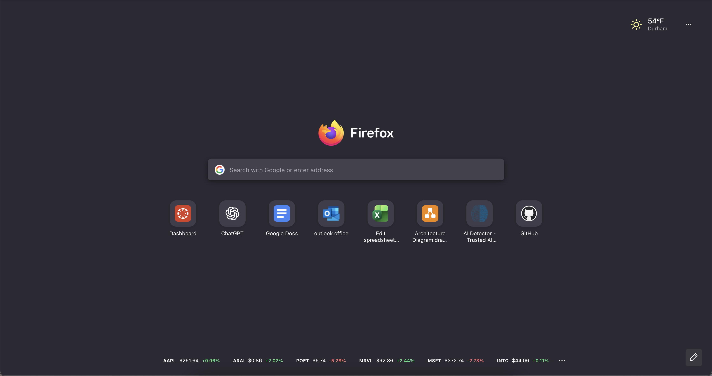

# Firefox Home Stocks Kit

Add a stock ticker bar to the real built-in Firefox Home / New Tab page without replacing Firefox Home, overriding it with an extension, or losing the native search/shortcuts experience.

This project uses Firefox AutoConfig plus `userChromeJS`. It is not a WebExtension.



## What It Does

- keeps the real Firefox Home / New Tab page
- keeps the native Firefox logo and search box
- keeps recommended and pinned shortcuts
- adds a stock ticker row at the bottom of `about:newtab` and `about:home`
- lets you add, refresh, remove, and reorder symbols directly from the page
- uses a Firefox-style three-dots action menu with `Add`, `Refresh`, and `Edit`
- supports edit mode with a Firefox-themed check button and visible delete controls
- fades and auto-scrolls long symbol lists like a ticker, then switches to manual scrolling while editing

## Requirements

- macOS
- Firefox desktop
- write access to the Firefox app bundle and your Firefox profile
- Firefox fully quit before install or uninstall

## Repository Layout

```text
firefox-home-stocks-kit/
  app/
    config.js
    config-prefs.js
  docs/
    stock-bar-screenshot.png
  profile/
    chrome/
      bottomStocks.uc.js
      rebuild_userChrome.uc.js
      test.uc.js
      userContent.css
      utils/
        BottomStocksChild.sys.mjs
        BottomStocksParent.sys.mjs
        chrome.manifest
        userChrome.jsm
        xPref.jsm
  install-macos.sh
  sync-to-firefox.sh
  pull-from-firefox.sh
  uninstall.sh
```

## How It Works

Firefox loads the app-side AutoConfig files from `app/`. Those files bootstrap `userChromeJS` from the target Firefox profile. The profile-side scripts then register a window actor for `about:newtab` and `about:home`, fetch quote data from Yahoo Finance's chart endpoint, fall back to Stooq if Yahoo fails, and inject the ticker UI into the native page.

The stock bar uses a Firefox-native interaction model:

- a three-dots action button opens `Add`, `Refresh`, and `Edit`
- edit mode swaps the menu trigger for an accent-colored check button
- symbols can be dragged and reordered at any time
- long lists auto-scroll with edge fades in normal mode and become manually scrollable in edit mode

## Install

```bash
cd "/path/to/firefox-home-stocks-kit"
./install-macos.sh
```

Optional profile override:

```bash
PROFILE_DIR="$HOME/Library/Application Support/Firefox/Profiles/your-profile.default-release" ./install-macos.sh
```

Optional Firefox app override:

```bash
FIREFOX_APP="/Applications/Firefox Developer Edition.app" ./install-macos.sh
```

The installer:

- detects the active Firefox profile
- creates a timestamped backup under `backups/`
- records install metadata so uninstall can match backups to the correct Firefox app/profile pair
- copies `app/config.js` into the Firefox app bundle
- copies `app/config-prefs.js` into the Firefox app bundle defaults
- copies only the managed `profile/chrome/` files into the selected Firefox profile

## Daily Workflow

Edit this repo as the source of truth, then push changes into Firefox:

```bash
./sync-to-firefox.sh
```

If you changed files directly in the live Firefox app/profile and want to bring them back into the repo:

```bash
./pull-from-firefox.sh
```

## Uninstall

Run:

```bash
./uninstall.sh
```

Optional explicit backup restore source:

```bash
BACKUP_DIR="/path/to/firefox-home-stocks-kit/backups/20260323-153000" ./uninstall.sh
```

`uninstall.sh` will:

- try to restore app/profile files from the newest matching backup for the selected Firefox app/profile, or from `BACKUP_DIR` if provided
- otherwise remove only files that still exactly match this project’s installed copies
- leave changed files in place if it detects they were modified after install

## After Install Or Major Changes

1. Start Firefox.
2. Open `about:support`.
3. Use `Clear startup cache...` once if Firefox does not pick up changes immediately.
4. Open a new tab.

## Customization

- Symbols and their order are stored in the Firefox pref `userChromeJS.bottomStocks.symbols`.
- Quote data comes from Yahoo Finance's chart endpoint, with Stooq as a fallback source.
- Stock links open on Yahoo Finance.
- The current implementation assumes US-style symbols when building quote URLs.
- The action menu currently includes `Add`, `Refresh`, and `Edit`.
- Edit mode keeps the edge-fade overflow treatment but stops auto-scrolling so you can browse and delete manually.

## Notes

- This is not a standard extension and will not appear in Firefox’s add-ons UI.
- Firefox updates may overwrite the app-side `config.js` and `config-prefs.js`. If that happens, rerun `./install-macos.sh`.
- If you already use your own `userChromeJS` setup, install/uninstall behavior matters: this repo backs up and restores files, but you should still review what is in `backups/` before deleting anything.
- The included screenshot is a real captured project image stored in `docs/`.

## Publishing / Sharing

For GitHub, this repo is already the shareable source package. Someone else can clone or download it and run the installer on their own Mac:

```bash
git clone https://github.com/<you>/firefox-home-stocks-kit.git
cd firefox-home-stocks-kit
./install-macos.sh
```

They still need to run the installer locally because Firefox app locations and profile paths differ per machine.
